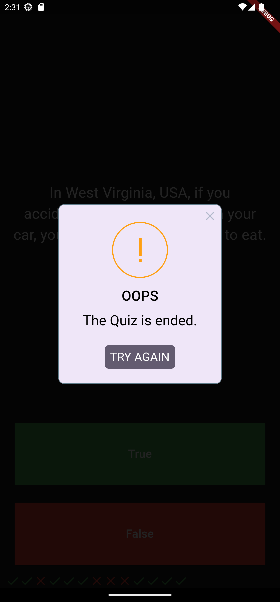

# Quiz App

This is a simple quiz app developed using Flutter. The app allows users to answer true or false questions. It includes a class called `Question` with two attributes: `question` (the actual question) and `answer` (the correct answer). The app also displays an alert dialog using the `rflutter_alert` package.

## Features

- Users can answer true or false questions.
- Questions are stored as objects of the `Question` class.
- Alert dialog is displayed at the end of the quiz.

## Installation

1. Clone the repository:

   ```bash
   git clone https://github.com/ADEL-tec/Quizzler.git
    ```
2. Change to the project directory:
    
    ```bash
   cd quiz-app
    ```

3. Install the dependencies:
    
    ```bash
    flutter pub get
    ```

4. Run the app:

    ```bash
    flutter run
    ```


## Usage

Once the app is installed and running on your mobile device or emulator, follow these steps:

1. Read the question displayed on the screen.
2. Choose either "True" or "False" as your answer.
3. Tap the "Submit" button.
4. The app will display the next question.
5. Repeat steps 1-4 until you have answered all the questions.
6. At the end of the quiz, an alert dialog will be displayed showing your score.

## Screenshots

  

## Dependencies

The following dependencies are used in this project:

- `flutter`
- `rflutter_alert`

These dependencies are defined in the `pubspec.yaml` file.

## Contributing

Contributions are welcome! If you encounter any issues or have suggestions for improvements, please open an issue on the GitHub repository.

## License

This project is licensed under the [MIT License](LICENSE).
